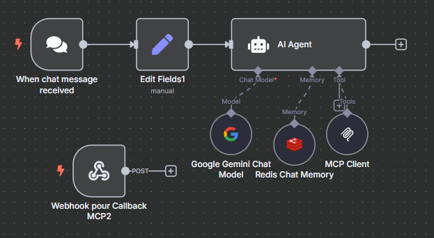
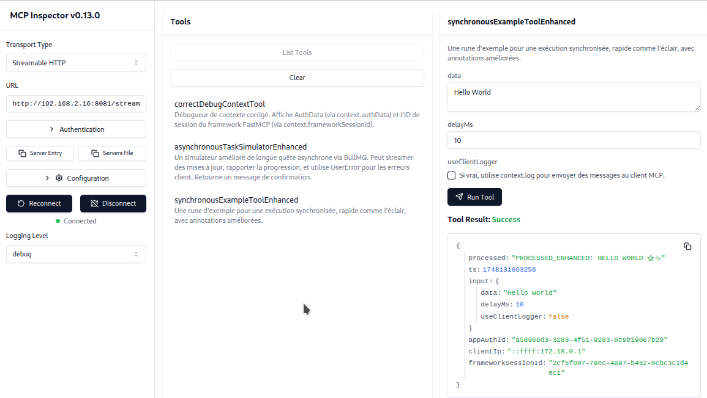
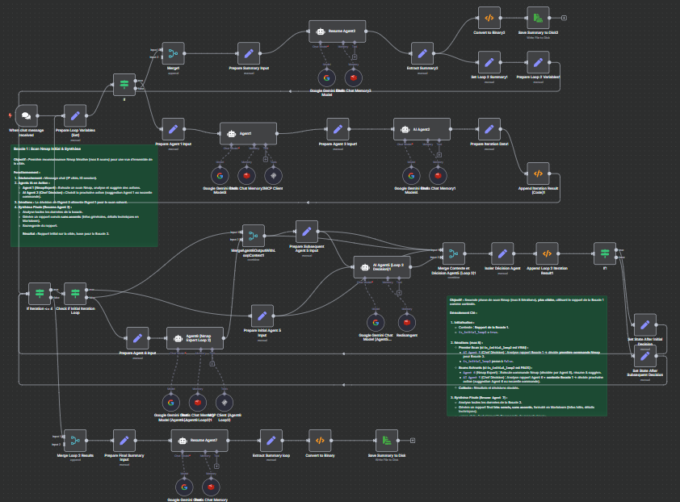

# Projet d'Assistant Agent Intelligent



> **Bienvenue !** Ce projet vous guide dans la construction d'un assistant agent intelligent capable non seulement de dialoguer, mais aussi d'agir et de vous aider à accomplir des tâches concrètes.

---


## 🧐 Que fait cet agent ?

Cet agent intelligent est un véritable partenaire numérique. Il ne se contente pas de discuter ; il agit. Voici ce qu'il peut faire concrètement :

* **Comprendre et Planifier :** Grâce à l'IA de Google, il décode vos instructions, même complexes, et établit un plan d'action.
* **Raisonner avec une Personnalité Modifiable :** Au cœur de l'agent se trouve un "prompt system" que vous pouvez entièrement personnaliser. Modifiez ses instructions de base, son caractère, sa manière de réfléchir ou ses objectifs pour créer un assistant parfaitement adapté à vos besoins.
* **Exécuter une infinité de Tâches :** Sa véritable force réside dans sa "boîte à outils" extensible. Imaginez pouvoir lui demander de :
    * **Chercher sur le web** et vous synthétiser les résultats.
    * **Lire et écrire dans des fichiers** sur le serveur.
    * **Générer et exécuter du code** dans n'importe quel langage.
    * **Envoyer des emails ou des notifications** sur Slack et Discord.
    * **Se connecter à n'importe quelle API** (météo, bourse, gestion de projet...).
    * **Générer des images** à partir d'une description.
    * **Interagir avec des bases de données** pour en extraire des informations.
    * ... Et bien plus encore. Chaque nouvel outil est un nouveau super-pouvoir.
* **Mémoriser le Contexte :** Il se souvient de vos conversations précédentes pour affiner ses réponses et ses actions, offrant une assistance personnalisée.
* **Rendre Compte :** Une fois sa mission accomplie, il vous présente le résultat de manière claire et concise.

---

## 🧰 La boîte à outils de l'Agent (Outils MCP)  

Notre agent possède une "boîte à outils" spéciale fournie par un serveur assistant, le **serveur MCP** (Model Context Protocol), qui lui confère des capacités uniques.



#### 🕵️ L'outil d'identification
* **Nom de code :** `debugContextTool`
* **Description :** Permet à l'agent de vérifier qui lui parle. C'est un badge de sécurité qui confirme votre identité.

#### 🐢 L'outil Marathon (Asynchrone)
* **Nom de code :** `asynchronousTaskSimulatorEnhanced`
* **Description :** Pour les missions longues (ex: un grand calcul). L'agent lance la tâche, vous prévient qu'il a commencé, et vous envoie le résultat seulement quand il a terminé.

#### ⚡ L'outil Sprinter (Synchrone)
* **Nom de code :** `synchronousExampleTool`
* **Description :** Pour les tâches très rapides. L'agent exécute la commande et vous donne la réponse immédiatement.

### 🎨 Créez vos propres outils !

**Le projet est modulaire !** Vous pouvez inventer et ajouter vos propres outils à la boîte à outils de l'agent pour lui donner de nouveaux super-pouvoirs. N'hésitez pas à expérimenter et à étendre les capacités de votre assistant.

---

## 🚀 Au-delà de l'Agent : Vers l'Organisation Numérique

Ce projet est une première brique. En assemblant plusieurs agents, chacun avec des compétences spécifiques, on peut créer une véritable **organisation numérique**.

Imaginez un **agent "manager"** qui décompose un objectif complexe en sous-tâches et les distribue à des **agents "spécialistes"** (chercheur web, analyste, rédacteur, programmeur...). Ces agents collaborent pour accomplir une mission d'envergure. En maîtrisant ce projet, vous faites le premier pas pour orchestrer une **entreprise entièrement numérique**.



---

## ⚙️ Guide d'Installation

Pour faire fonctionner l'agent, vous devez déployer ses deux composants principaux : le moteur de workflow **n8n** et le **Serveur MCP** qui lui fournit les outils.

### ✅ Prérequis

1.  **Un Serveur :** Un ordinateur distant fonctionnant 24h/24.
    * **Type :** Serveur Privé Virtuel (VPS) recommandé.
    * **Système d'exploitation :** **Ubuntu 22.04**.
2.  **Un Client SSH :** Le logiciel sur votre ordinateur personnel pour vous connecter à votre serveur.
    * **Windows :** Terminal Windows, PowerShell, ou [PuTTY](https://www.putty.org/).
    * **macOS / Linux :** L'application "Terminal" intégrée.
3.  **Docker :** L'outil de conteneurisation pour lancer n8n. Si vous ne l'avez pas, suivez le [guide d'installation officiel de Docker](https://docs.docker.com/engine/install/ubuntu/).

### 🛠️ Étapes d'installation

#### Étape 1 : Installer et lancer n8n

Sur votre serveur, exécutez la commande suivante pour télécharger et démarrer n8n dans un conteneur Docker. L'application sera accessible sur le port `5678`.

```bash
docker run -it --rm --name n8n -p 5678:5678 -v n8n_data:/home/node/.n8n docker.n8n.io/n8nio/n8n
```
Étape 2 : Installer le Serveur MCP 
Ensuite, clonez le dépôt du serveur MCP et suivez les instructions de son propre fichier README.md pour le configurer et le lancer.

```bash

git clone [https://github.com/Jboner-Corvus/MCP-Server-Asynchrone.git](https://github.com/Jboner-Corvus/MCP-Server-Asynchrone.git)
cd MCP-Server-Asynchrone
# Suivez les instructions du README de ce projet
```
Une fois ces deux étapes terminées, votre agent sera prêt à fonctionner !